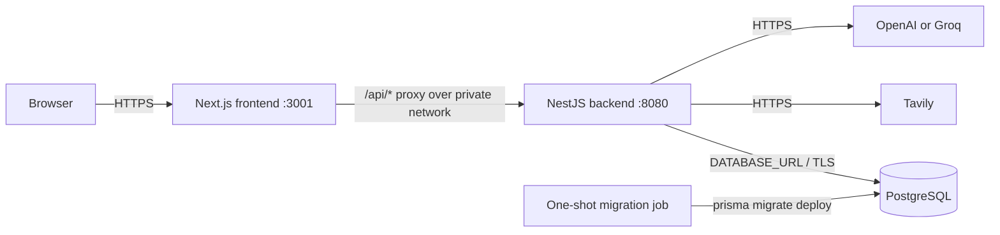

# Deployment Guide

This guide covers the production-shaped Docker Compose setup in this repository
and a platform-neutral deployment where PostgreSQL, the NestJS backend, and the
Next.js frontend are deployed as separate services.

## 1. Important security boundary

The current product is a single-user V2 application. It does **not** implement
authentication, authorization, user-scoped records, rate limiting, or usage
quotas. Do not expose the backend directly to the public internet. For an
internet deployment, use one of these controls until application-level auth is
implemented:

- Put the whole application behind an identity-aware proxy or private VPN.
- Allow public traffic only to the frontend and keep the backend on a private
  service network.
- If a public backend is unavoidable, put an API gateway with authentication,
  strict rate limits, request-size limits, and spend controls in front of it.

The frontend's default `/api/*` proxy makes the second topology straightforward.

## 2. Prepared architecture



The browser does not receive `BACKEND_URL`, `DATABASE_URL`, or provider keys.
Browser requests use `/api/perplexity/*`; Next.js forwards them to
`BACKEND_URL`. In Compose, the frontend and backend share the `application`
network, while only the backend and migration job share the internal `database`
network.

## 3. Deployment artifacts

| Artifact | Purpose |
| --- | --- |
| `backend/Dockerfile` | Multi-stage, non-root NestJS runtime plus a separate Prisma migration target and database-aware health check |
| `frontend/Dockerfile` | Multi-stage, non-root Next.js standalone image |
| `compose.yaml` | PostgreSQL, migration job, backend, frontend, health checks, volumes, and isolated networks |
| `.env.example` | Local Compose variables and secret placeholders |
| `backend/.env.example` | Complete backend variable reference for non-Compose deployments |
| `frontend/.env.example` | Frontend server-side backend URL |

Both applications require Node.js 20.9 or newer when run without Docker. The
provided images use Node.js 22 Alpine.

## 4. Environment variables

### Backend

The backend validates its environment before accepting traffic. A missing
database URL, Tavily key, selected-provider key, malformed port, invalid timeout,
wildcard CORS value, or invalid origin causes startup to fail clearly.

| Variable | Required | Production guidance |
| --- | --- | --- |
| `NODE_ENV` | Yes | Set to `production`. |
| `HOST` | No | Defaults to `0.0.0.0`; keep this in containers. |
| `PORT` | No | Defaults to `8080`. |
| `DATABASE_URL` | Yes | PostgreSQL URL. Require TLS for a managed or remote database, normally with `sslmode=require`. |
| `TAVILY_API_KEY` | Yes | Load from the platform secret manager. |
| `AI_PROVIDER` | No | `openai` (default) or `groq`. |
| `OPENAI_API_KEY` | Conditional | Required when `AI_PROVIDER=openai`. |
| `GROQ_API_KEY` | Conditional | Required when `AI_PROVIDER=groq`. |
| `CORS_ORIGINS` | No | Comma-separated exact origins, with no paths or trailing slashes. Leave empty when browsers use only the frontend proxy. `*` is rejected. |
| `LOG_LEVEL` | No | `error`, `warn`, `log`, `debug`, or `verbose`; use `log` normally. |
| `TRUST_PROXY` | No | Set `true` only when the backend is behind a trusted reverse proxy that controls forwarded headers. |
| Provider model/timeouts | No | See `backend/.env.example`; defaults are applied when omitted. |
| Tavily result/depth/timeout settings | No | See `backend/.env.example`. |

Use a database URL similar to:

```text
postgresql://APP_USER:URL_ENCODED_PASSWORD@DB_HOST:5432/APP_DB?schema=public&sslmode=require
```

If a provider supplies both pooled and direct PostgreSQL URLs, use the pooled
URL for normal backend traffic only if it is Prisma-compatible. Run migrations
with the provider's direct/session URL by setting `DATABASE_URL` differently on
the migration job.

### Frontend

`BACKEND_URL` is server-only and must be set both when `next build` (or the
frontend Docker build) runs and on the running frontend container. It is
compiled into the Next.js rewrite configuration and read at runtime by
server-rendered routes. Use the same value in both places. It must be an
absolute HTTP(S) URL that the **frontend server** can reach; it does not need to
be browser-accessible.

```text
BACKEND_URL=http://backend.internal:8080
```

Do not rename it to `NEXT_PUBLIC_BACKEND_URL`; that would expose service
topology to the browser. Rebuild and redeploy the frontend when this URL
changes.

### Secret handling

- Use the cloud platform's secret manager or encrypted secret store in
  production. The root `.env` workflow is for local Compose only.
- Never commit `.env`, API keys, database URLs, or generated secret files. The
  repository ignores local env files while tracking the examples.
- Give the application database user only rights on its own database/schema.
  Use separate administrative credentials for provisioning where possible.
- Rotate API and database credentials on a schedule and immediately after any
  suspected disclosure.
- Do not print `docker compose config` output into tickets or CI logs because it
  can contain interpolated secrets. Use `docker compose config --quiet` for
  validation.
- Provider prompts and full questions are not emitted by the new HTTP request
  logger. Avoid adding request bodies to production logs.

## 5. Production-shaped local test with Docker Compose

### Step 1: create local configuration

From the repository root:

```bash
cp .env.example .env
```

Edit `.env` and set:

1. A long, URL-safe `POSTGRES_PASSWORD` (letters, digits, `_`, and `-` avoid URL
   encoding issues in the Compose-generated URL).
2. A real `TAVILY_API_KEY`.
3. `AI_PROVIDER=openai` plus `OPENAI_API_KEY`, or `AI_PROVIDER=groq` plus
   `GROQ_API_KEY`.

The example placeholder values intentionally do not provide working external
service access.

### Step 2: validate and build

```bash
docker compose config --quiet
docker compose build
```

The frontend build uses `http://backend:8080`, the private Compose service name.
The database image is not published to the host.

### Step 3: start the stack

```bash
docker compose up -d
docker compose ps -a
docker compose logs migrate
```

Expected state:

- `database`, `backend`, and `frontend` are running and healthy.
- `migrate` exited with code `0`. This is success for the one-shot job.
- PostgreSQL data is stored in the `postgres_data` named volume.

The dependency chain is deliberate: PostgreSQL must be healthy, then migrations
must succeed, then the backend starts, then the frontend starts.

### Step 4: basic verification

```bash
curl --fail --silent http://localhost:8080/health/live
curl --fail --silent http://localhost:8080/health/ready
curl --fail --silent http://localhost:3001/
curl --fail --silent "http://localhost:3001/api/perplexity/threads?limit=1"
```

The readiness response should contain `"database":"up"`. The fourth command
verifies browser-equivalent traffic through Next.js, NestJS, and PostgreSQL.

### Step 5: end-to-end AI verification

This request incurs Tavily and AI-provider usage:

```bash
curl --no-buffer --fail-with-body \
  --request POST \
  --header 'Content-Type: application/json' \
  --header 'Accept: text/event-stream' \
  --data '{"question":"What is PostgreSQL?"}' \
  http://localhost:3001/api/perplexity/ask/stream
```

Confirm that the stream includes `start`, `progress`, `delta`, `final`, and
`done` events. Then open <http://localhost:3001>, ask a question, refresh the
page, and verify that the thread remains in history. Persistence after refresh
confirms the full frontend -> backend -> database path.

### Step 6: inspect or stop

```bash
docker compose logs -f backend frontend
docker compose down
```

`docker compose down` preserves PostgreSQL data. `docker compose down -v`
deletes the database volume and all local application records; use it only when
you intentionally want a clean database.

## 6. Run production builds without Compose

### Database and backend

```bash
cd backend
cp .env.example .env
npm ci
npm run prisma:validate
npm run prisma:migrate:deploy
npm run build
npm run start:prod
```

Never use `prisma migrate dev` in production. `prisma migrate deploy` applies
the checked-in migrations without creating new migration files.

### Frontend

In a second shell:

```bash
cd frontend
cp .env.example .env.local
npm ci
npm run build
npm run start
```

Set `BACKEND_URL` in `.env.local` before building. The frontend listens on port
3001 by default.

## 7. Deploy services independently

The exact console names vary by provider, but the order and settings below work
for a VM, Kubernetes, ECS, Cloud Run-like containers, or a PaaS with private
service networking.

### Step 1: provision PostgreSQL

1. Create a PostgreSQL database and dedicated application user.
2. Restrict inbound connections to the backend and migration runner.
3. Require TLS for any non-local connection.
4. Enable automated backups and point-in-time recovery when available.
5. Set retention, maintenance windows, storage alerts, connection limits, and
   a tested restore procedure.
6. Keep the database region close to the backend to reduce latency.

Before every schema release, take or confirm a restorable backup. The checked-in
migrations are forward migrations; rollback normally means restoring the prior
application version and, for a destructive schema change, restoring data or
applying a separately reviewed corrective migration.

### Step 2: build and publish the backend image

```bash
docker build \
  --target runner \
  --tag REGISTRY/perplexity-backend:RELEASE \
  ./backend
docker build \
  --target migration \
  --tag REGISTRY/perplexity-migrate:RELEASE \
  ./backend
docker push REGISTRY/perplexity-backend:RELEASE
docker push REGISTRY/perplexity-migrate:RELEASE
```

Use an immutable release tag or digest, not only `latest`.

### Step 3: run the migration release job

Run exactly one short-lived job using the new migration image and a direct
database URL:

```bash
docker run --rm \
  --env DATABASE_URL='REDACTED_DIRECT_DATABASE_URL' \
  REGISTRY/perplexity-migrate:RELEASE
```

On a managed platform, configure the equivalent release/pre-deploy job. Do not
run `migrate deploy` independently in every autoscaled backend replica. Stop the
rollout if the migration job fails.

### Step 4: deploy the backend

Configure the backend container as follows:

- Command: `npm run start:prod`
- Container port: `8080` (or the value of `PORT`)
- Liveness: `GET /health/live`
- Readiness: `GET /health/ready`
- Shutdown: send `SIGTERM` and allow at least 30 seconds before forced kill
- Network: private ingress from the frontend/reverse proxy; outbound HTTPS to
  Tavily and the selected AI provider; PostgreSQL access to the database
- Resources: start around 0.5-1 vCPU and 512 MiB RAM, then adjust using observed
  latency and memory rather than treating these as guarantees
- Replicas: start with one; autoscale only after database connection limits and
  concurrent AI spend are bounded

Set all backend variables from Section 4. Application logs go to stdout/stderr.
HTTP completion and failure records contain request ID, method, path, status,
and duration; internal exceptions retain stack traces in server logs while
unexpected clients receive only `Internal server error`. Forward the
`X-Request-Id` response value into support and tracing workflows.

The AI endpoint streams Server-Sent Events. At every load balancer or reverse
proxy in front of it:

- Disable response buffering and caching for `/api/perplexity/ask/*`.
- Allow streaming/chunked responses.
- Use an idle/request timeout longer than the configured search and AI
  timeouts; 90 seconds is a reasonable initial value.
- Preserve client disconnects so the backend can abort provider work.

### Step 5: build and publish the frontend image

Choose a backend URL reachable from the frontend container. Prefer private DNS:

```bash
docker build \
  --build-arg BACKEND_URL=http://perplexity-backend.internal:8080 \
  --tag REGISTRY/perplexity-frontend:RELEASE \
  ./frontend
docker push REGISTRY/perplexity-frontend:RELEASE
```

If the platform does not provide build-time private service names, use the
backend's HTTPS URL and restrict that endpoint at the gateway. Remember that
changing `BACKEND_URL` requires rebuilding this image.

### Step 6: deploy the frontend

- Command: `node server.js` (already set by the image)
- Container port: `3001`
- Health check: `GET /`
- Public ingress: HTTPS only
- Backend egress: allow the address compiled into `BACKEND_URL`
- Runtime variable: set `BACKEND_URL` to the same URL passed to the image build

Terminate TLS at the platform load balancer or reverse proxy. Redirect HTTP to
HTTPS, enable HSTS at the edge after HTTPS is verified, and set secure DNS. Only
the frontend needs a public hostname in the preferred topology.

If browsers intentionally call a public backend directly, set:

```text
CORS_ORIGINS=https://app.example.com
TRUST_PROXY=true
```

Use comma-separated exact origins for multiple frontend domains. CORS is not an
authentication control and does not prevent non-browser clients from calling a
public API.

### Step 7: deployment order for updates

1. Build immutable backend and frontend images.
2. Confirm a current database backup.
3. Run `prisma migrate deploy` once and require success.
4. Roll out the backend and wait for readiness.
5. Roll out the frontend.
6. Run the verification checklist below.
7. Keep the prior images available for application rollback.

For future destructive schema changes, use expand/migrate/contract releases so
old and new application versions can overlap safely.

## 8. Post-deployment verification

Replace the sample hostnames:

```bash
curl --fail --silent https://api-internal.example.com/health/live
curl --fail --silent https://api-internal.example.com/health/ready
curl --fail --silent https://app.example.com/
curl --fail --silent \
  "https://app.example.com/api/perplexity/threads?limit=1"
```

Then verify:

- The frontend response includes `X-Content-Type-Options: nosniff` and
  `X-Frame-Options: DENY`.
- The backend does not expose `X-Powered-By`.
- `/health/live` remains healthy during a database outage, while
  `/health/ready` returns 503. This distinguishes process health from traffic
  readiness.
- A real streamed question emits incremental events without proxy buffering.
- The completed thread is visible after refresh and from another browser
  session allowed by the access gateway.
- A deliberately invalid API request returns a 4xx response with a
  `requestId`, and the same ID appears in backend logs.
- Application containers cannot connect directly to PostgreSQL from the public
  internet, and the frontend environment contains no provider/database keys.
- Backup status, error-rate alerts, latency alerts, disk/storage alerts, and
  provider spend alerts are active.

Useful header checks:

```bash
curl --head https://app.example.com/
curl --include https://api-internal.example.com/health/ready
```

## 9. Logging, errors, and operations

- Collect container stdout/stderr in a centralized log service and configure
  retention. Do not depend on container-local log files.
- Use `LOG_LEVEL=log` normally; temporarily enable `debug` only during a scoped
  investigation because it increases volume.
- Alert on backend readiness failures, 5xx rate, high duration, restarts,
  database saturation, provider failures, and migration job failures.
- Health checks deliberately do not call paid external providers. Verify
  Tavily/OpenAI/Groq separately with synthetic checks at a controlled cadence.
- The application masks unexpected 500 responses, but expected provider
  failures may still return operational messages. Do not include secret values
  in thrown errors.
- Add platform-level request/body limits and rate limits even on a private
  deployment. The application DTO currently bounds questions to 2,000
  characters, but gateway limits provide earlier protection.

## 10. Troubleshooting

### Backend exits immediately

Read startup logs. Environment validation names the missing or malformed key.
Confirm `AI_PROVIDER` matches the provider key you supplied and that
`CORS_ORIGINS` uses exact origins without paths.

### Migration job fails

Run the migration image with `npm run prisma:migrate:status` and the same
`DATABASE_URL`. Confirm the URL uses a direct/session connection, DNS and TLS
are correct, and the database user can create/alter the application schema. Do
not start the new backend version until migration state is understood.

### Frontend returns 502/connection refused for `/api/*`

The `BACKEND_URL` compiled into the frontend image is unreachable from the
frontend container. Rebuild with the correct private DNS name and verify that
both services share a network/security group.

### Streaming arrives all at once or times out

Disable proxy buffering/compression transformations for the SSE path, increase
idle timeouts, and confirm intermediaries honor `X-Accel-Buffering: no` and
`Cache-Control: no-cache, no-transform`.

### Backend is live but not ready

Check database DNS, credentials, TLS parameters, connection limits, and current
migration status. `/health/ready` intentionally fails when `SELECT 1` cannot
complete.
